---

## ⚠️ Working with Mac

The macOS Finder creates hidden system files automatically, which can interfere with updates.

To avoid issues:
- **Never** open or manage files using Finder.
- Always clean the USB drive via Terminal before ejecting:

```bash
sudo find . \
  \( -name ".DS_Store" \
  -o -name ".Spotlight-V100" \
  -o -name ".Trashes" \
  -o -name ".fseventsd" \
  -o -name ".TemporaryItems" \
  -o -name ".apdisk" \
  -o -name ".VolumeIcon.icns" \) \
  -o -name "._*" \
  -exec rm -rf {} +
```

> **Note:** Ensure Terminal has **Full Disk Access** enabled in System Preferences.

## 💾 Formatting USB Drive

If MMI does not detect your USB during an update, format it as **FAT32**.

## 📋 Enabling Various Menus in MMI

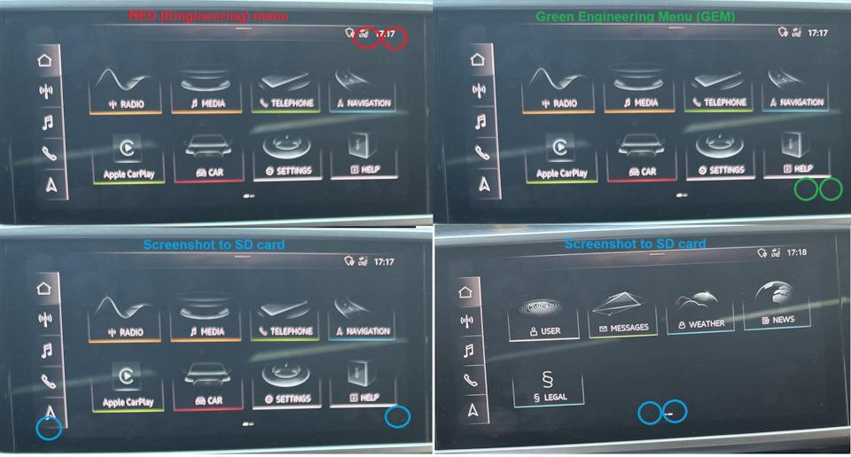

---

## ✅ Checking GEM on Stock Firmware

1. Format a fast USB drive as **FAT32**.
2. Place these repository folders in the USB root:
   ```
   Data
   Logs
   Meta
   Mods
   Storage
   ```

3. Enter the red menu: Hold two fingers in the **top-right corner** (navigate with passenger volume wheel).
4. Select **Update**:

   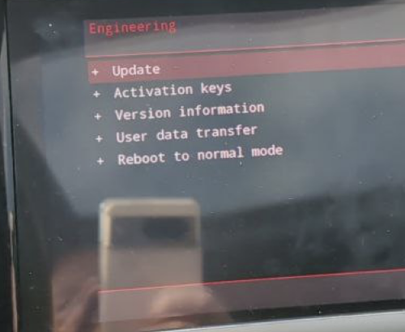

5. Choose **USB** as source.
6. Scroll down—only **"Exception List"** should have "Y":

   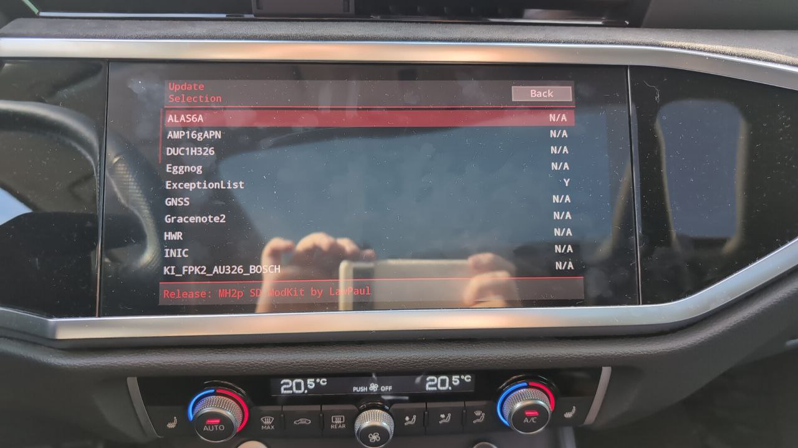

7. Scroll to the end, press **Start Update**:

   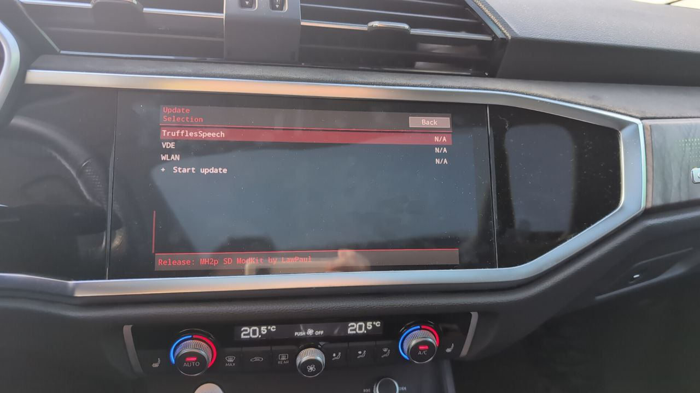

8. Wait for loading to finish, scroll down and select **Resume**:

   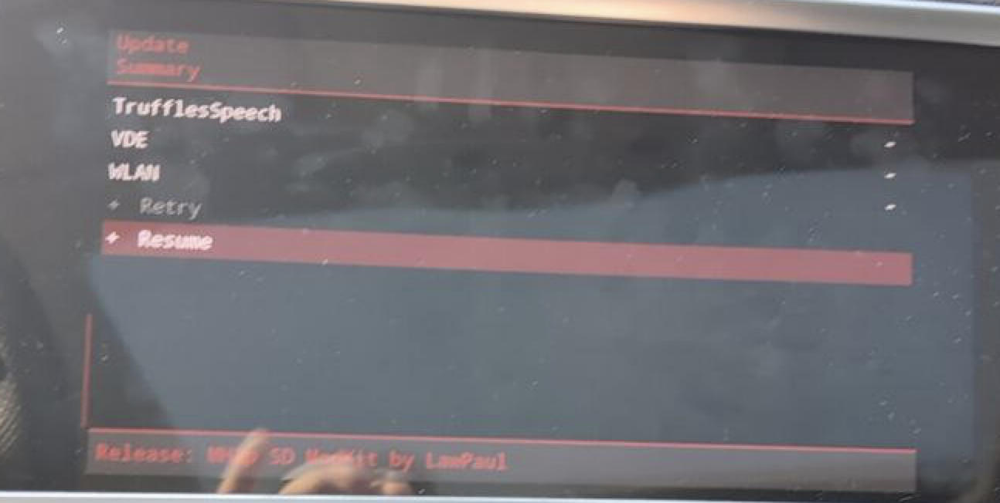

9. Restart normally.
10. Open the Green Engineering Menu (GEM) by holding two fingers at **bottom-right corner**.

   Verify it looks like this:

   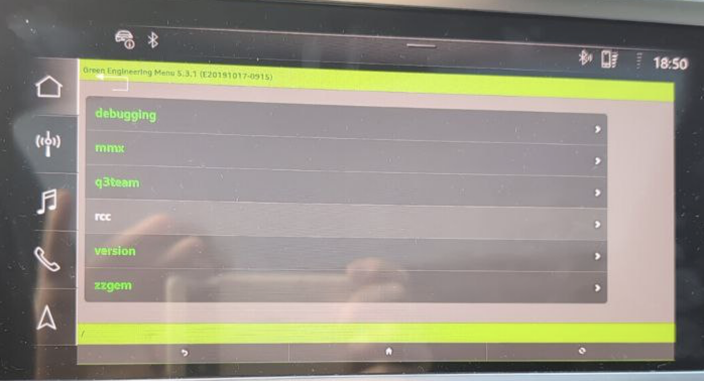

If everything is correct, you can exit.

---

## 🌍 Installing European Firmware

1. Confirm current firmware is **MH2p_AS_AU_P2711** (in MMI).
2. Go to [mibsolution.one](https://mibsolution.one) (user: **guest**, pass: **guest**).
3. Download the firmware:

   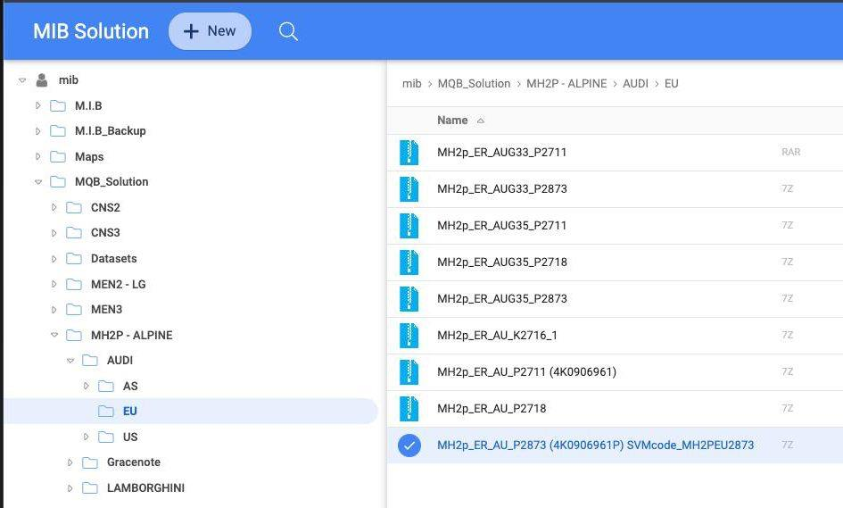

4. Replace the original file in the **Meta** folder with
 [Docs/files/main.mnf](files/main.mnf)
5. Copy all content onto USB.
6. Repeat steps **3-5** from the previous GEM update section.
7. Navigate to **User-Defined**:

   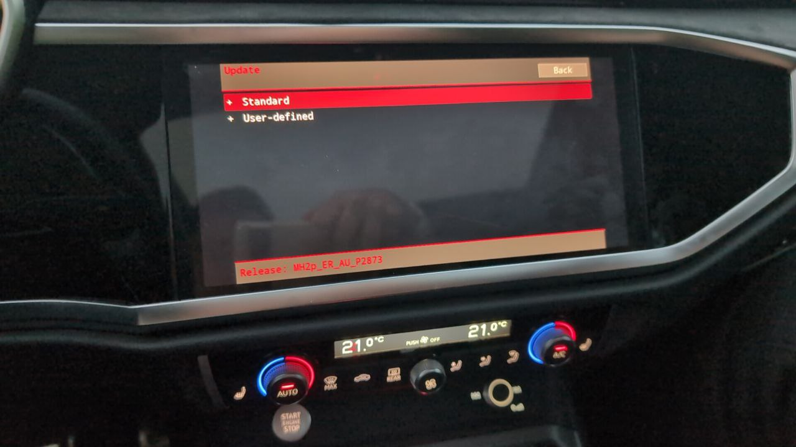

8. Verify there is nothing unusual:

   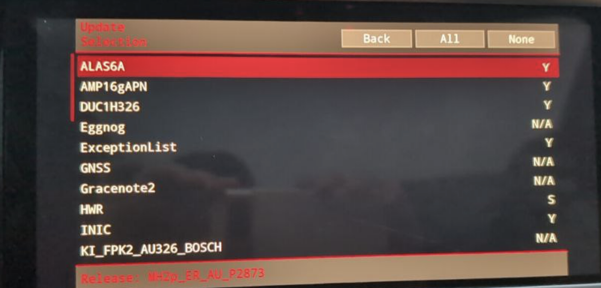  
   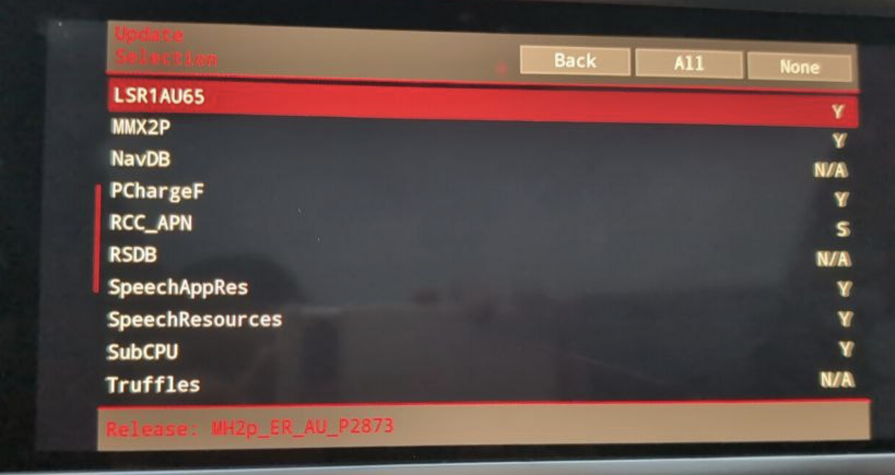  
   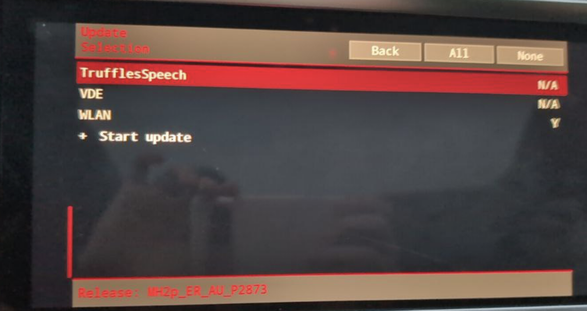

9. Press **Start Update**.
10. Wait **15-30 minutes** (depends on USB speed).
11. When done, scroll down and press **Resume**:

    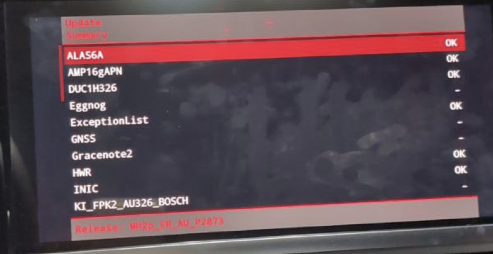

12. Restart normally.

---

## 🛠️ Installing a Mod

Repeat all steps from the first update instruction (GEM installing).

---

## 📲 Enabling Frameless CarPlay/Android Auto

1. Enter the GEM menu (touch input enabled).
2. Navigate:
   ```
   q3team -> carplay_and_aa_modification
   ```
3. Select your desired modification.
4. Reboot via GEM menu option.

